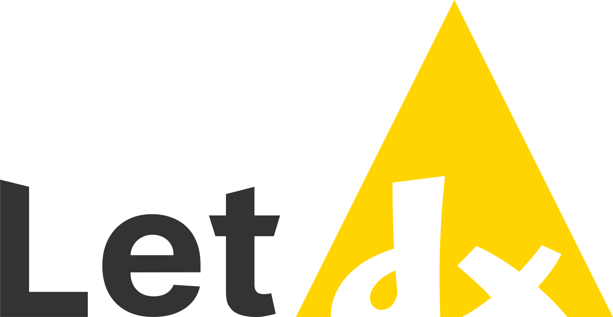

> [!WARNING]
> **This project is currently under active development!**
>
> Features, APIs, and architecture are subject to change without notice.

---

## Project Layout

Project is separated into two primary parts:

- **`LetDB`**: The core database server and storage engine.
- **`LetDD`**: The public-facing database driver that serves as a secure exposure layer.

---

## Artificial Intelligence

AI is used within the project but only in limited and clearly defined areas:

- **Documentation & Comments**: AI is used to help for documenting and to ensure comments use clear, proper English.
- **Code Generation**: We are **NOT** relying on AI to write the actual code or core logic. This is a deliberate choice
  to maintain code quality. We don't want to turn the codebase to unmaintainable slop.

---

## Building From Source

> [!NOTE]
> This project aggressively targets modern toolchains.

### Prerequisites

To compile from source, make sure your environment meets the following requirements:

| Requirement | Version                                                     | 
|-------------|-------------------------------------------------------------|
| CMake       | **4.0** or newer                                            |
| C Compiler  | **C23** compatible (The latest LLVM toolchain has priority) |
| Go Compiler | **1.26.4** or newer                                         |

### Steps

1. Clone the Repository:
   ```bash
   git clone https://github.com/mikuwithbeer/LetDX.git
   cd LetDX
   ```

2. Configure the Build:
   ```bash
   cmake -S . -B build -G "Unix Makefiles" -DCMAKE_BUILD_TYPE=Release
   ```

3. Compile the Project(s):
   ```bash
   cmake --build build --config Release
   ```

   Upon a successful build, the compiled binaries will be located inside the `build/` directory.

---

## Documentation

> [!NOTE]
> This section is currently being expanded and refined.

Comprehensive technical documentation and architectural details are maintained inside the `docs/` directory.
Check out the [OVERVIEW.md](docs/OVERVIEW.md) file for a high-level overview of the project.

---

## Docker Deployment

You can quickly deploy the project using pre-built images hosted on the GitHub Container Registry (GHCR).

1. Pull the Image:
   ```bash
   docker pull ghcr.io/mikuwithbeer/letdx:main
   ```

2. Docker Compose Setup:

   For production or local development, we recommend using [Docker Compose](https://docs.docker.com/compose/) to manage
   the database and daemon services together seamlessly.

   Create a `docker-compose.yml` file and paste the example below:

   ```yaml
   services:
     database:
       image: ghcr.io/mikuwithbeer/letdx:main
       entrypoint:
         - /app/LetDB
       restart: unless-stopped
       volumes:
         - transactions:/app/data

     daemon:
       image: ghcr.io/mikuwithbeer/letdx:main
       entrypoint:
         - /app/LetDD
       command: [ '-serve', '0.0.0.0:5543', '-connect', 'database:55543' ]
       ports:
         - '5543:5543'
       depends_on:
         - database
       restart: unless-stopped

   volumes:
     transactions:
    ```

3. Launch the Services:
   ```bash
   docker compose up -d
   ```

   To verify that both services are running smoothly, you can check the container status using `docker compose ps`.

> [!IMPORTANT]
> The provided `docker-compose.yml` serves as a baseline configuration.
>
> Depending on your specific use case, you might need to modify the given file (e.g., changing port mappings, updating
> volume paths, or configuring environment variables).

---

## Project Licensing

We use a dual-licensing model:

| Component | License                                      |
|-----------|----------------------------------------------|
| **LetDB** | BSD 3-Clause License[^1]                     |
| **LetDD** | European Union Public License (EUPL) 1.2[^2] |

[^1]: https://interoperable-europe.ec.europa.eu/licence/bsd-3-clause-new-or-revised-license

[^2]: https://interoperable-europe.ec.europa.eu/collection/eupl/eupl-text-eupl-12
