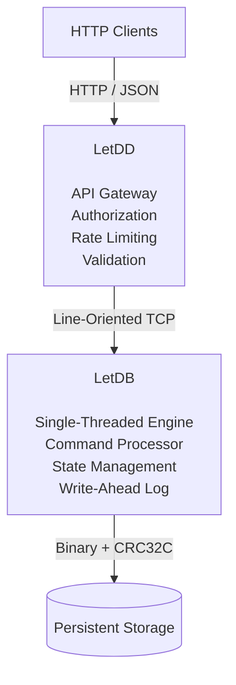

# Project Overview

LetDX is a robust system designed with a strict separation of concerns between its public-facing API and the underlying
storage engine.

---

## System Architecture

This design ensures that external clients interact with a secure interface while the core engine focuses solely on
efficient state management and durability.

---

## Responsibilities

### LetDB

- **State Management:** Maintains an in-memory state, applying requests deterministically during both runtime and
  failure recovery.
- **Protocol Hosting:** Exposes a compact line-oriented TCP protocol for internal communication with other clients.
- **Data Durability:** Persists all state changes to a write-ahead log on disk, ensuring that the system can recover to
  a consistent state after crashes or restarts.
- **Integrity Verification:** Secures every entry with a checksum, fully supporting automated replay and
  truncation of corrupted entries upon restart.

### LetDD

- **Client Interface:** Provides a secure HTTP API for external clients, handling JSON payloads for external clients to
  manage accounts and execute transfers.
- **Translation Layer:** Converts HTTP requests into TCP commands, ensuring that the internal protocol remains compact
  and efficient.
- **Access Control:** Implements authentication, permission checks, and rate limiting to protect the system from abuse.
- **Connection Management:** Maintains a persistent TCP connection, assuring that requests are processed in order.

---

## Exemplary Lifecycle

This is a general outline of the transfer process:

1. A client sends a `POST /accounts` request to `LetDD` with the JSON payload:
   `{"credits": 0, "debits": 1000, "flags": ["send", "receive"]}`.
2. `LetDD` validates the request, generates the corresponding TCP command, assigns an ID,
   and forwards it to `LetDB`.
3. `LetDB` processes the command, commits the entry, and replies to the daemon.
4. `LetDD` parses the response and returns to the client.

---

## Further Reading

For specific architectural layers, refer to the following documentation:

- **[LetDB](LETDB.md)**
- **[LetDD](LETDD.md)**
